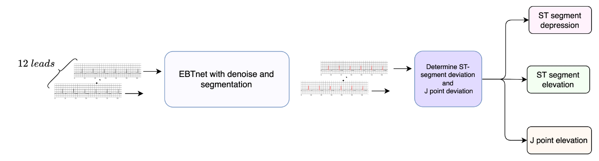
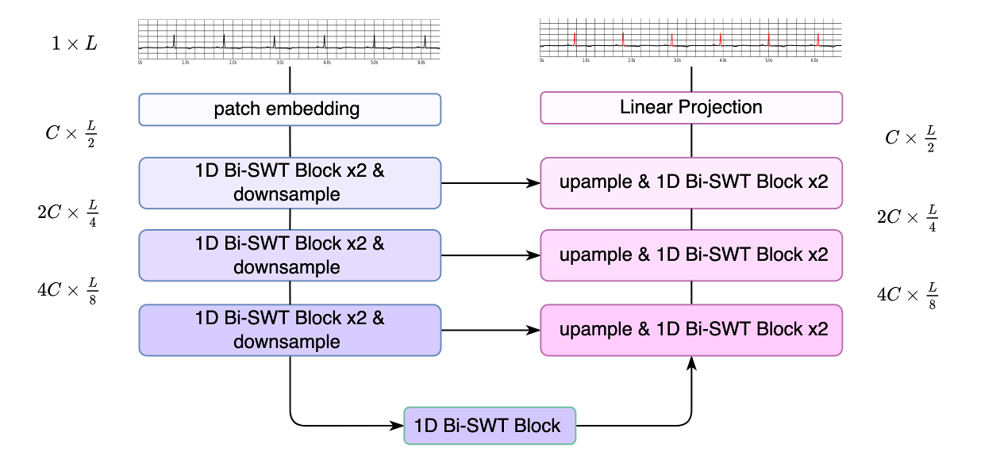

# ST Holter

This repo is the official implementation of "Using Multi-Task Learning-based Framework to Detect ST-segment and J-point Deviation from Holter". 

This including the whole train code of our proposed transformed based model. 

This two Holter ECG datasets (R-ECG and E-ECG) from Ruijing Hospital collected for this study will be available after approval by the corresponding author.

## Introduction

We proposed a Transformer based structure to precisely detect the location and deviation of ST-segment and J point on 12 leads Holter ECG data in a beat level and provide cardiologists more accurate information about myocardial ischemia.






### dataset preparation
1. To train **denoise model**, manual generate train and val csv in following path     
It should only contain normal ECG feather paths,  The noise csv is provied by this this repo:   
```
./data/noise/train_denoise.csv
./data/noise/val_denoise.csv
```
the denoise ECG data is saving in feather, each feather file contains 12 leads.
the example feather files are proven in `./data/noise/`

2. To train **segmentation model**, manual generate train and val csv in following path     
the example csv is provided, contain the data path.
```
./data/segmentation/train_segmentation.csv
./data/segmentation/val_segmentation.csv
```
 
the segmentation ECG data is saving in csv, each feather file contains 12 leads.
the example feather files are proven in `./data/segmentation/`


### train the model
the model is training with config file, which setting the dataset and hypermeter
once set the config, 

to train denoise
```
python3 train_unet_denoise.py --config ./configs/denoise.yaml
```

to train segmentation
```
python3 train_unet_semseg.py --config ./configs/segmentation.yaml
```


